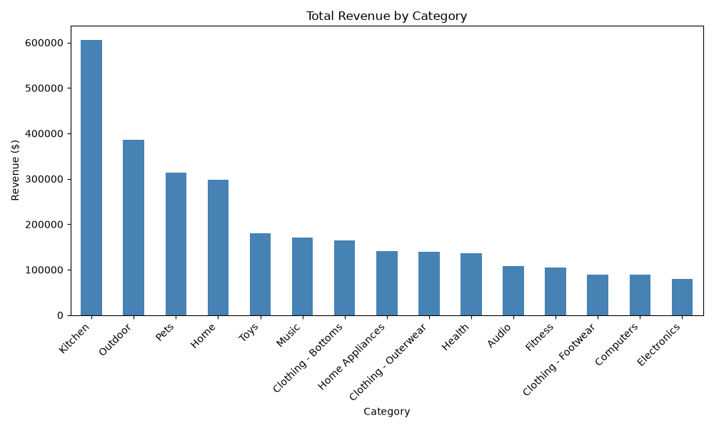
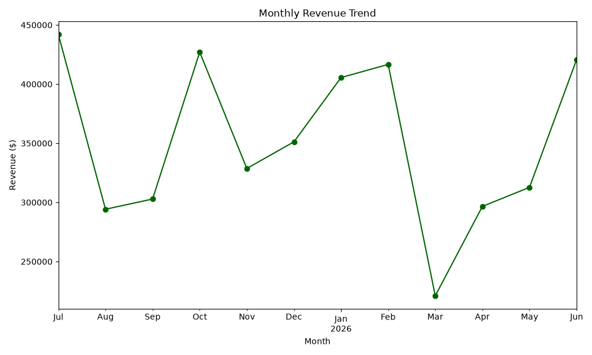

# Retail Revenue Analysis (Python + SQL)

A Python analysis project that connects to a live PostgreSQL database (hosted on Supabase),
pulls transactional data with SQLAlchemy, and uses pandas to analyze revenue by category
and over time. This project builds directly on my [SQL analytics project](https://github.com/Fitbert/retail-sql-analytics),
which contains the schema and business-question queries for the same database.

## What it does

- Connects to a Supabase-hosted PostgreSQL database using SQLAlchemy
- Pulls order, product, and order-item data with a SQL query joined across 3 tables
- Uses pandas to calculate per-line-item revenue (`quantity * unit_price_at_sale`)
- Aggregates revenue by product category (top 15 shown) and by month
- Visualizes both with matplotlib

## Charts

**Revenue by Category**



**Monthly Revenue Trend**



## What I learned / debugged

- Filtering categories down to the top 15 was necessary — the raw category field had
  82 distinct values (an artifact of how the sample data was generated), which made
  the first version of the chart unreadable.
- Ran into a `NameError` from a missing `sqlalchemy` import, and a silent failure where
  `plt.show()` was hanging without a configured GUI backend in VS Code on Windows —
  fixed by explicitly setting `matplotlib.use('TkAgg')`.
- Kept database credentials out of the repo using a `.env` file (excluded via `.gitignore`)
  and `python-dotenv` to load them at runtime.

## Tools

Python, pandas, SQLAlchemy, psycopg2, matplotlib, PostgreSQL (via Supabase)

## Setup (to run locally)

```bash
python -m venv venv
source venv/bin/activate   # Windows: venv\Scripts\activate
pip install pandas sqlalchemy psycopg2-binary matplotlib python-dotenv
```

Create a `.env` file in the project root:
```
DATABASE_URL=postgresql://your_connection_string_here
```

Then run:
```bash
python analysis.py
```